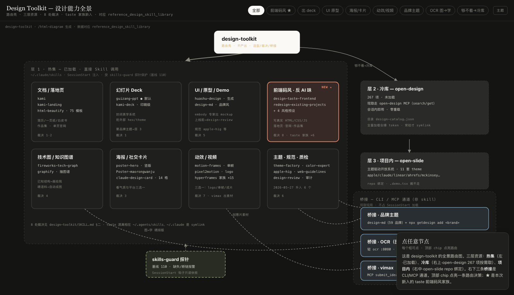

# Design Toolkit — 全景路由交互图

design-toolkit 设计能力路由壳的全景图：三层资源（热集 / 冷库 open-design / 项目内 open-slide）+ 8 处裁决 + taste 前端码风家族 + 桥接通道 + skills-guard。

**▶ 在线交互：** https://htmlpreview.github.io/?https://raw.githubusercontent.com/ZCDeng/dtk-panorama/main/PANORAMA.html

可点节点看详情，顶部 chip 点亮路由决策，右上角切暗色。由 `/html-diagram` 生成，数据对应 reference_design_skill_library。

